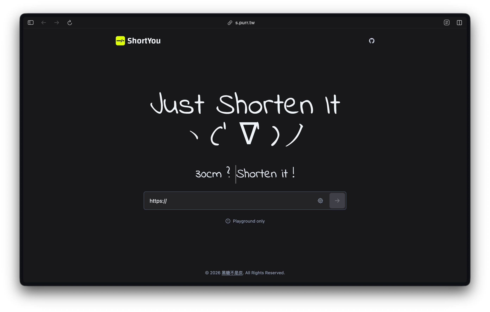

<div align="center">
  <h1> ShortYou</h1>
  <a href="https://github.com/HeiTang/ShortYou/blob/main/LICENSE">
    
  </a>
  <a href="https://github.com/HeiTang/ShortYou/releases">
    
  </a>
  <a href="https://github.com/HeiTang/ShortYou">
    
  </a>
  <br><br>
  
  
  <p>- - -</p>
  <p><i>“ ShortYou is a lightweight URL Shortener. ”</i></p>
  <p>ShortYou can shorten the lengthy URL and easy to share link with other people.</p>
</div>

<p align="center">
  English | <a href="./README.zh-TW.md">繁體中文</a>
</p>

## Overview

ShortYou is a lightweight, self-hostable URL shortener with a split frontend/backend architecture that keeps public resolution and controlled creation as separate flows.

- Public visitors can open existing short links directly.

- Invited users can enter create mode through a capability token.

- The frontend can be deployed on static hosting, while the backend remains on Google Apps Script.

- Maintainers can adjust the frontend experience and backend rules independently.

## Usage Modes

| Mode | URL Format | Description | Backend Interaction |
| --- | --- | --- | --- |
| Public homepage | `/` | Shows the playground and product entry point | Does not create short links |
| Public resolve | `/#alias` | Resolves an alias and redirects to the original URL | `GET` lookup |
| Controlled create | `/#t=<token>` | Enters authorized create mode and submits real create requests | `POST` create |

> ShortYou uses hash routing instead of `/alias` path routing, so the frontend can be deployed directly on static hosting such as GitHub Pages.

## Features

- ⭐️ Lightweight and self-hostable

- ⚙️ Supports custom aliases and random aliases

- 🔒 The create flow can be controlled by capability tokens

- 🛡️ Can use Cloudflare Turnstile to verify create requests

- 🖥️ Frontend, backend, and storage can be maintained separately

## Quick Start

1. Visit [https://s.purr.tw/](https://s.purr.tw/) to open the homepage.

2. Existing short links look like `https://s.purr.tw/#your-alias`.

3. If you receive a dedicated create link, open it to enter authorized create mode.

4. The public playground is for demonstration only and does not create real short links.

## Tech Stack

| Layer | Technology | Purpose |
| --- | --- | --- |
| Frontend | Astro 5, TypeScript, Tailwind CSS | Single-page UI, hash routing, create flow, and resolve flow |
| Backend | Google Apps Script, TypeScript | Alias lookup, short link creation, authorization, and validation |
| Storage | Google Sheets | Short link records, authorization records, and audit logs |
| Verification | Cloudflare Turnstile, capability tokens | Human verification and access control for the create flow |
| Tooling | npm scripts, clasp wrapper, custom env loader | Frontend build, GAS push/deploy, and runtime config sync |

## Project Structure

```text
.
├── src/
│   ├── pages/index.astro        # frontend single-page entry
│   ├── scripts/                 # resolve, create, hash routing, and UI logic
│   ├── components/              # shared page components
│   └── styles/global.css        # global styles
├── gas/
│   ├── src/
│   │   ├── entrypoints.ts       # GAS global entry and runtime config bootstrap
│   │   ├── controller.ts        # HTTP request dispatch
│   │   ├── services.ts          # query, create, and validation domain logic
│   │   ├── repository.ts        # Google Sheets access layer
│   │   └── config.ts            # backend config loading
│   ├── Code.js                  # build artifact for deployment, do not edit manually
│   └── SyncConfig.js            # runtime config bootstrap injected during deployment
├── scripts/                     # frontend build and GAS push/deploy wrapper scripts
├── public/                      # static assets
└── docs/demo/                   # README preview assets
```

If you are changing behavior, you usually only need to edit `src/` and `gas/src/`. `gas/Code.js` is a generated artifact and should not be edited by hand.

## Local Development

### Requirements

- Node.js and npm

- A Google account with Apps Script deployment access

- A Google Sheets document used as the storage layer

- If you want to enable CAPTCHA, prepare a Cloudflare Turnstile site key and secret

### Environment Files

| File | Purpose |
| --- | --- |
| `.env.dev` | Local frontend development and local environment settings |
| `.env.prod` | Production frontend build and production environment settings |
| `.env.dev.example` | Local configuration template |
| `.env.prod.example` | Production configuration template |

The README should not contain real sensitive values. Use example files to share the schema, and keep actual values in private environments or a secrets manager.

### Common Commands

| Command | Description |
| --- | --- |
| `npm install` | Install dependencies |
| `npm run dev:frontend` | Start the frontend development server |
| `npm run build:frontend` | Build the frontend static site |
| `npm run preview:frontend` | Preview the production frontend build |
| `npm run build:gas` | Build `gas/src/` into `gas/Code.js` |
| `npm run typecheck:gas` | Run GAS TypeScript type checking |
| `npm run build:all` | Build the frontend and backend together |

## Deployment

ShortYou uses split deployment by default, so the frontend can stay on static hosting while the backend connects to Google Sheets through GAS.

### 1. Prepare environment settings

- For the frontend, you need `PUBLIC_API_URL`, `PUBLIC_TURNSTILE_SITE_KEY`, and either `PUBLIC_SITE_URL` or `GAS_PUBLIC_SITE_URL`.

  | Parameter | Description | Default |
  | --- | --- | --- |
  | `PUBLIC_API_URL` | Public URL of the GAS Web App | None |
  | `PUBLIC_TURNSTILE_SITE_KEY` | Cloudflare Turnstile site key | None |
  | `PUBLIC_SITE_URL` | Public frontend site URL used for Astro site metadata and generated deploy artifacts | None |
  | `GAS_PUBLIC_SITE_URL` | Compatible fallback for the same frontend site URL in shared CI/deploy environments | None |

- For the backend, you need at least `GAS_SCRIPT_ID`, `GAS_PUBLIC_SITE_URL`, `GAS_ENFORCE_CAPTCHA`, and `GAS_ENFORCE_ACCESS_CONTROL`.

  If CAPTCHA is enabled, you also need `GAS_TURNSTILE_SECRET`.

  | Parameter | Description | Default |
  | --- | --- | --- |
  | `GAS_SCRIPT_ID` | Script ID of the GAS project | None |
  | `GAS_PUBLIC_SITE_URL` | Public site URL used by the backend | None |
  | `GAS_ENFORCE_CAPTCHA` | Whether CAPTCHA verification is required | false |
  | `GAS_ENFORCE_ACCESS_CONTROL` | Whether access control is required | false |
  | `GAS_TURNSTILE_SECRET` | Cloudflare Turnstile secret key | None |

### 2. Deploy the frontend

- Run `npm run build:frontend` to generate `dist/`.

- Deploy `dist/` to GitHub Pages or another static host.

- The frontend connects to the target GAS Web App through `PUBLIC_API_URL`.
- Generated deploy artifacts such as `dist/CNAME` and `dist/robots.txt` use `PUBLIC_SITE_URL` first and fall back to `GAS_PUBLIC_SITE_URL`.

### 3. Push or deploy the backend

| Command | Purpose |
| --- | --- |
| `npm run gas:push:local` | Push the local backend code and settings |
| `npm run gas:push:production` | Push the production backend code and settings |
| `npm run gas:deploy:local` | Publish a local GAS Web App version |
| `npm run gas:deploy:production` | Publish a production GAS Web App version |

These scripts handle the build, `clasp push`, and the runtime config bootstrap. After deployment, the backend syncs Script Properties on the first request.

### 4. Verify the deployment

- Open the homepage and confirm the playground loads correctly.

- Use `/#alias` to test an existing short link lookup and redirect.

- Use `/#t=<token>` to test authorized create mode and Turnstile verification.

## Contributing

Issues and pull requests are welcome.

If you plan to change behavior, first decide whether the change belongs to frontend UX, backend rules, or deployment flow. The repository structure intentionally separates those concerns.

## License

This project is licensed under the [MIT License](LICENSE).
