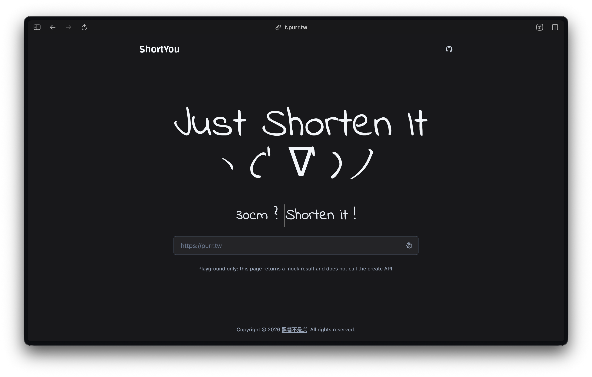

  <h1>✨ ShortYou</h1>
  
  
  
    
  
  
  
- - -

  
<i>「 ShortYou 是一個輕量的短網址服務。 」</i>

  
ShortYou 可以把冗長網址縮短成更容易分享的連結。

  <a href="./README.md">English</a> | 繁體中文

## 專案簡介

ShortYou 提供簡單的公開短網址體驗，並將建立流程控制在受邀使用者手上。

- 一般訪客可以直接使用既有短連結。

- 受邀使用者可透過專屬入口建立新短網址。

- 維護者可分開自架前端與後端。

## 功能特色

- ⭐️ 輕量且可自行部署

- ⚙️ 需要時可自訂 alias

- 🔒 受邀使用者才能進入建立流程

- 🖥️ 前後端可分開部署與維護

## 快速使用

1. 開啟 [https://t.purr.tw/](https://t.purr.tw/) 進入首頁。

2. 已建立的短連結格式如 `https://t.purr.tw/#your-alias`。

3. 如果你收到專屬建立連結，開啟後即可進入建立模式。

4. 公開 playground 僅供展示，不會真的建立短網址。

## 自行部署

ShortYou 採用簡單的分離式部署，適合個人或小型團隊維護。

- 前端：GitHub Pages

- 後端：Google Apps Script

- 儲存：Google Sheets

如需實際部署、開發與維運細節，請從維護文件開始閱讀。

## 文件

- [docs/maintainer-guide.zh-TW.md](docs/maintainer-guide.zh-TW.md) - 維護與自架入口。
- [docs/backend-spec.zh-TW.md](docs/backend-spec.zh-TW.md) - 提供維護者參考的後端規格。

## 貢獻

歡迎提出 issue 與 pull request。

若要調整文件，請讓根目錄 README 保持使用者導向，將部署與維運細節放在 docs 目錄中。

## 授權

本專案採用 [MIT License](LICENSE)。
